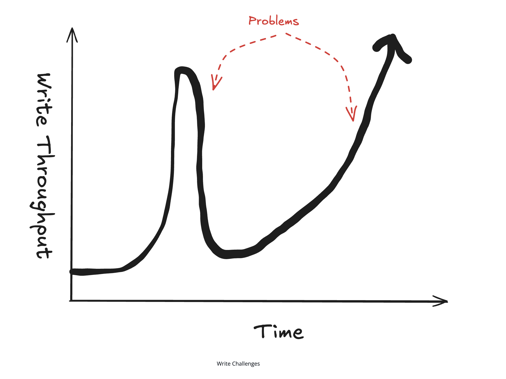

# 📈 Scaling Writes — System Design Interview Cheat Sheet

> A practical, interview-ready guide to handling high-volume write traffic in large-scale systems.

---

## 🎯 What Is Scaling Writes?

**Scaling writes** is the challenge of handling **high-throughput, bursty write operations** when a single database or server becomes a bottleneck due to:
- Disk I/O limits
- CPU saturation
- Network bandwidth constraints

Unlike reads (which are easy to cache or replicate), **writes are harder to scale** and are a favorite topic in system design interviews.

---

## 🧠 Core Interview Insight

> **Write scaling is about reducing load per component** — not just adding hardware.

You do this by:
- Spreading writes
- Smoothing bursts
- Reducing write frequency
- Dropping low-value writes when necessary

---

## 🧩 The 4 Fundamental Write-Scaling Strategies

### 1️⃣ Vertical Scaling & Write Optimization (Start Here)

Before adding architectural complexity, always check if a **single machine** can go further.

#### Vertical Scaling
- Upgrade CPU, RAM, SSDs, and network
- Modern servers can handle **far more writes** than many candidates assume
- Use back-of-the-envelope math to validate limits

#### Write Optimizations
- Reduce number of indexes
- Batch write-ahead-log (WAL) flushes
- Disable expensive DB features during high-write periods:
  - Foreign keys
  - Triggers
  - Full-text indexes

📌 **Interview Tip:** Show restraint — don’t shard prematurely.

---

### 2️⃣ Database Choices (Write vs Read Tradeoff)

Some databases are optimized specifically for **write-heavy workloads**.

#### Key Idea
- Optimizing writes often **hurts reads**
- You must identify the real bottleneck first

#### Examples of Write-Optimized Storage
- Append-only / log-structured storage
- Time-series databases (sequential writes)
- Column-oriented databases (batch-friendly)

#### General Optimizations
- Fewer indexes = faster writes
- Larger batch commits
- Sequential disk access > random seeks

📌 **Interview Signal:** Explain *why* a DB is good for writes, not just *which* DB.

---

### 3️⃣ Sharding & Partitioning (Horizontal Scaling)

When one machine is no longer enough, distribute writes across many.

---

#### Horizontal Sharding

- Split data across multiple servers (shards)
- Route writes using a **partitioning key**

##### Choosing a Good Partition Key
- Goal: **even distribution of writes**
- Good keys:
  - userId
  - postId
- Bad keys:
  - country
  - region

⚠️ Poor keys create **hot shards** and wasted capacity.

📌 Always ask:
- How many shards does one request hit?
- How often does that request happen?

---

#### Vertical Partitioning

Split data by **access pattern**, not rows.

Example (Social Media Post):
- Post content → write-once, read-many
- Engagement metrics → high-frequency writes
- Analytics/events → append-only

Benefits:
- Each dataset can scale independently
- Different storage engines per workload

📌 This is a **data modeling** problem as much as a scaling problem.

---

### 4️⃣ Handling Bursts: Queues & Load Shedding

Real-world traffic is **not steady** — bursts are inevitable.

---

#### Write Queues

Used to absorb **short-lived spikes** in traffic.

Benefits:
- Decouples write acceptance from processing
- Smooths bursty traffic

Tradeoffs:
- Async writes
- Eventual consistency
- Risk of unbounded backlog if steady-state is broken

📌 Use queues for **bursts**, not as a band-aid for insufficient capacity.

---

#### Load Shedding

When overloaded, **reject or drop low-value writes**.

Examples:
- Drop frequent location updates
- Drop impressions but keep clicks
- Ignore near-duplicate updates

📌 Better to partially degrade than to fail entirely.

---

### 5️⃣ Batching & Hierarchical Aggregation (Big Wins)

Instead of accepting every write as-is, **change the shape of writes**.

---

#### Batching

Combine many writes into fewer operations.

Where batching can happen:
- Application layer
- Intermediate processors
- Database layer

Benefits:
- Fewer network calls
- Lower transaction overhead

Tradeoffs:
- Added latency
- Possible data loss if the app crashes

📌 Batching only helps if many writes target the same data.

---

#### Hierarchical Aggregation (Extreme Scale)

Used in analytics, metrics, and live systems.

Pattern:
- Aggregate writes in stages
- Reduce data volume at each step

Examples:
- Likes/comments aggregation
- Stream analytics
- Live dashboards

📌 Converts **N×M writes** into **manageable batches** at the cost of latency.

---

## 🔥 Common Interview Deep Dives

### 🔁 Resharding

Problem: Need to add shards without downtime.

Solution:
- Gradual migration
- Dual writes (old + new shards)
- Read preference for new shards

---

### 🔥 Hot Keys

When a single key overwhelms a shard.

Solutions:
- Split key into multiple sub-keys
- Aggregate on reads
- Dynamic splitting for viral items

Tradeoffs:
- Write amplification
- Read amplification

📌 Works best for **counters and metrics**, not atomic objects.

---

## 🧪 When to Use (and When Not To)

### ✅ Use When:
- Write throughput is the main bottleneck
- Traffic is bursty or unpredictable
- System handles metrics, feeds, analytics

### ❌ Avoid When:
- Scale is small
- Latency requirements are strict
- Complexity outweighs benefit

📌 Always justify with quick math.

---

## 🧠 Final Interview Takeaway

> **Scaling writes = making each component handle manageable load**

You achieve this by:
- Sharding writes
- Smoothing bursts
- Batching operations
- Aggregating data
- Dropping low-value writes

Strong candidates:
- Identify write bottlenecks early
- Apply the simplest solution first
- Clearly explain tradeoffs

---

✅ This pattern appears frequently in:
- Social media systems
- News feeds
- Search indexing
- Analytics pipelines
- Live streaming platforms

---

**End of Cheat Sheet**

